<div align="center">

# 🌀 DATA VORTEX 2026

### Rebuilding the Social Engine — the complete two-round build

**Forge-X** · Kunal Choudhary · *Aaruush'26*

**PART 1 · Round 1 · 13–16 September** — `12,360 raw rows → 10,221 analysis rows` · `27 justified repairs` · `45 SQL queries`
**PART 2 · Round 2 · 17–18 September** — `9,000 labelled texts → 7,900 modelled` · `sentiment macro-F1 0.613` · `topic macro-F1 0.805` · `14 tests passing`

</div>

---

## The competition in one minute

One social platform, two collapsed layers, one rule: **nothing is fabricated,
nothing is hardcoded, every claim must survive its own refutation.** Round 1
handed us a dataset hidden behind a broken website and a dead analytics core;
Round 2 handed us a dead semantic layer and 9,000 labelled texts.

| | **Part 1 · Round 1** | **Part 2 · Round 2** |
|---|---|---|
| what collapsed | the data intake + the analytical core | the semantic comprehension layer |
| the data | 12,360 corrupted posts + 1,500 users, recovered from a puzzle site | Dataset 2 — 9,000 labelled texts, MD5-verified against the official drop |
| what we built | cleaning pipeline (27 logged repairs) · schema'd SQLite core · 45 SQL answers | TF-IDF + linear sentiment & topic classifiers · LDA/NMF cross-check · 2 report PDFs |
| headline result | `12,360 − 360 − 1,779 = 10,221` closes exactly; the "midnight peak" trap refuted | sentiment macro-F1 **0.6134** · topic macro-F1 **0.8051**; errors read, not averaged |
| the doctrine | hold-outs reconcile · NULLs stay NULL · findings must survive refutation | one split, one seed, one test touch · margins reported, not celebrated |
| reproduce | `./run_all.sh` → `21 passed` | `./run_round2.sh` → `14 passed` |
| submission set | [`submission/phase2/`](submission/phase2/MANIFEST.md) | [`submission/round2_form_upload/`](submission/round2_form_upload/SUBMISSION_DETAILS.md) |

> **Every number in this README is generated.** Part 1's tables and figures are
> produced by `./run_all.sh` from the two recovered CSVs; Part 2's by
> `./run_round2.sh` from Dataset 2 — nothing is typed by hand, because the
> rulebook disqualifies hardcoded outputs and prohibits fabricated data.
> Re-run them and you land on identical numbers.

---

## Contents

**PART 1 — Round 1** · [jump](#part-1)

1. [The result in 30 seconds](#the-result-in-30-seconds)
2. [Reproduce it](#reproduce-it)
3. [How the dataset was recovered](#how-the-dataset-was-recovered)
4. [Corruption inventory and repairs](#corruption-inventory-and-repairs)
5. [The two decisions that needed proof](#the-two-decisions-that-needed-proof)
6. [Exploratory analysis](#exploratory-analysis)
7. [The SQL analytical core](#the-sql-analytical-core)
8. [The Phase 2 challenge set](#the-phase-2-challenge-set)
9. [What we tested and rejected](#what-we-tested-and-rejected)
10. [Repo structure](#repo-structure)
11. [Assumptions and limitations](#assumptions-and-limitations)
12. [Rulebook compliance](#rulebook-compliance)

**PART 2 — Round 2** · [jump](#part-2)

1. [Round 2 in 30 seconds](#round-2-in-30-seconds)
2. [Reproduce it — Round 2](#reproduce-it--round-2)
3. [The dataset and the intake decisions](#the-dataset-and-the-intake-decisions)
4. [Preprocessing: conservative by design](#preprocessing-conservative-by-design)
5. [Model selection: a bake-off, not a guess](#model-selection-a-bake-off-not-a-guess)
6. [Training methodology](#training-methodology)
7. [Results](#results)
8. [Error analysis: reading the mistakes](#error-analysis-reading-the-mistakes)
9. [The unsupervised cross-check that failed (and is published anyway)](#the-unsupervised-cross-check-that-failed-and-is-published-anyway)
10. [What we tested and rejected — Round 2](#what-we-tested-and-rejected--round-2)
11. [Repo structure (the Round 2 slice)](#repo-structure-the-round-2-slice)
12. [Assumptions and limitations — Round 2](#assumptions-and-limitations--round-2)
13. [Rulebook compliance — Round 2](#rulebook-compliance--round-2)

---

<a id="part-1"></a>

# PART 1 — Round 1 · Data Intake Restoration & Analytical Core

| | |
|---|---|
| **Team** | **Forge-X** |
| **Member** | Kunal Choudhary |
| **Phase 1** | cleaned dataset + EDA report + this repo |
| **Phase 2** | `queries/challenges.sql` + `output/Phase2_Insight_Report.pdf` |
| **Phase 2 challenge set** | `queries/phase2_challenges.sql` + `output/Phase2_ChallengeSet_Report.pdf` |
| **Phase 2 form upload set** | [`submission/phase2/`](submission/phase2/MANIFEST.md) — 4 slots, 8 files, labelled E1–H6 |

---

## The result in 30 seconds

The task: a social platform's data pipeline has collapsed. Recover the dataset
(it is **not** given — it is hidden behind a broken website), clean it, explain
every repair, then rebuild the analytics in SQL.

**What we did**

- Solved the site puzzle and recovered `Dataset 01` — **12,360** post rows + **1,500** user rows, provenance-verified against the live site.
- Found **10 distinct corruption families**, applied **27 logged repairs**, and closed the row arithmetic exactly: `12,360 - 360 duplicate replays - 1,779 empty-text hold-outs = 10,221`.
- Caught the trap the event buried: the "**midnight posting culture**" is fake — see [Exploratory analysis](#exploratory-analysis).
- Built a schema'd SQLite core (PK/FK/CHECK constraints, 2 views, long-form hashtag relation) and answered **12 challenges** with CTEs, `NTILE`, `LAG/LEAD`, `RANK` and windowed aggregates — every output captured live.
- **Refuted five plausible-sounding findings** with statistics instead of publishing them ([§8](#what-we-tested-and-rejected)).

---

## Reproduce it

```bash
git clone <this-repo> && cd <this-repo>
pip install -r requirements.txt
./run_all.sh
```

Ends with `21 passed` and two PDFs. Stages, if you want them one at a time:

| Command | Produces |
|---|---|
| `python src/verify_source.py` | re-downloads both files, byte-compares to `data/raw/`, records SHA-256 |
| `python src/clean_data.py` | `data/clean/` — clean CSVs, JSON, `repair_log.csv`, `data_quality_report.md` |
| `python src/eda.py` | `output/figures/*.png` + `output/eda_stats.json` (every number the report quotes) |
| `python src/build_db.py` | `output/social_engine.db` — schema, constraints, views |
| `python src/run_sql.py` | runs `queries/challenges.sql`, writes `output/sql_outputs.md` |
| `python src/make_screenshots.py` | `output/screenshots/Q1..Q12.png` |
| `python src/build_report.py` | both submission PDFs |
| `python src/make_notebook.py` | builds **and executes** `notebooks/01_data_cleaning_eda.ipynb` |
| `python -m pytest tests -q` | `21 passed` |

Deterministic: no random seeds, no sampling, no model, no network at run time
(`verify_source` is optional and offline-tolerant).

---

## How the dataset was recovered

The rulebook says the corrupted dataset "will not be given directly". The site
serves an empty `<div>` — every guessed data URL (`/dataset.csv`, `/api/data`,
`/logs`) 404s. The logic lives in its JS bundle, so the bundle was read and the
four hints resolved 1:1:

| Rulebook hint | What it pointed at in the bundle |
|---|---|
| "may not reveal everything at first glance" | 4 of the 5 dashboard modules are deliberate dead ends rendering *"this module cannot be displayed"* |
| "look closely at the recovery logs … beginning of each line" | SYSTEM LOG lines are prefixed `hh:mm:ss  service  …`; two of seven name **`node_07`** |
| "a message hidden in plain sight" | the italic line under the log panel: `last known surviving node: node_07` |
| "follow the pattern. Decode the connection. Find the node." | `help` advertises only `help/status/scan/logs/clear`, but the handler matches free text against `(connect\|access\|restore\|reconnect\|link)` **and** `(node.?0?7\|archive)` |

**No advertised command can win** — the archive opens only through that regex
branch. Typing:

```
connect node_07
```

unlocks `ARCHIVE NODE 07`, which serves the two files from `/dataset/`. An
organiser debug panel at `?test=true` prints a field literally named
`Real path → terminal: connect node_07`, independently confirming the route.

📄 Full step-by-step (for the viva): [`docs/recovery_walkthrough.md`](docs/recovery_walkthrough.md)

> **Provenance.** Both files are downloaded verbatim. `src/verify_source.py`
> re-fetches them and reports `2 matched · 0 mismatched`, writing SHA-256s to
> `output/provenance.json`. As a bonus check, the same two CSVs are also embedded
> as string literals in the app bundle for the in-browser download buttons — and
> they parse to **identical rows** (12,361 and 1,501 incl. header), so we know we
> have the real dataset and not a decoy.

---

## Corruption inventory and repairs

Profiling came first; every rule below answers a defect that was observed, not a
checklist item. Counts are from `data/clean/repair_log.csv`.

| Defect in the raw intake | Rows | Treatment | Justification |
|---|---:|---|---|
| exact duplicate rows | **360** | dropped; `post_id` made a real PK | identical across all 8 fields = outage retry replay |
| negative `likes` | **525** | `abs()` restore, row-flagged | mirrored distribution, one column only (see [the proof section](#the-two-decisions-that-needed-proof)) |
| `likes` as float strings (`-1205.0`) | 525 | cast to nullable `Int64` | keeps NULL ≠ 0 |
| blank / `NULL` likes | 1,858 | real NULL, **never imputed** | fabrication is prohibited |
| blank / `NULL` platform | 1,846 | explicit `Unspecified` bucket | not an invented platform |
| blank or `NULL` text body | 1,779 | held out to a separate CSV | count must reconcile |
| injected `<br>` / `<div>` | 663 | markup stripped, text kept | renderer artefact |
| trailing `&amp;` entity | 341 | unescaped, orphaned `&`/`,` trimmed | layered corruption |
| double-encoded UTF-8 (`C3 A9`) | 316 | latin-1 round-trip reversed | see [the proof section](#the-two-decisions-that-needed-proof) |
| three timestamp formats | 4,805 / 3,669 / 3,526 | one UTC datetime, ambiguity flagged | see [the proof section](#the-two-decisions-that-needed-proof) |

**Reconciliation** — the single most auditable line in this submission:

```
12,360 raw  -  360 exact duplicates  -  1,779 empty-text hold-outs  =  10,221 analysis rows
```

Held-out rows are written to `data/clean/Social_Engine_Posts_EmptyText_HeldOut.csv`
rather than deleted, so the identity closes from files on disk.

---

## The two decisions that needed proof

**Day-first dates.** `timestamp` holds ISO-8601, epoch-seconds **and**
`dd-mm-yyyy`. For that last block, `MM-DD` vs `DD-MM` is settled arithmetically:

```
of the 3,622 raw dd-mm-yyyy rows:
   first field  > 12 :  2,172      <- a day
   second field > 12 :      0      <- a month can never be 25
```

Month-first is impossible for most of the block, so one convention (day-first)
is applied to all of it; mixing readings per row would invent a distribution. The
1,450 rows where both fields are ≤ 12 are genuinely ambiguous — all flagged with
`flag_ambiguous_date_format`, and no claim in this repo depends on them.

**Negative likes are a sign flip, not lost data.**

| | count | median | max |
|---|---:|---:|---:|
| positive `likes` | 9,976 | 2,505 | 5,000 |
| \|negative `likes`\| | 525 | 2,388 | 4,987 |

`likes` is the *only* numeric column with negatives (`shares`, `comments` have
zero), every negative carries a `.0` suffix while positives are bare integers,
and the negatives mirror the positives' distribution and their 5,000 ceiling.
Lost data would be *missing*, not a mirror image — so magnitude is restored and
every row flagged. `RESTORE_SIGN_FLIPPED_LIKES = False` in `src/config.py`
switches to the conservative reading (null them) and the pipeline still runs.

📄 All 10 rules with reasoning: [`docs/cleaning_decisions.md`](docs/cleaning_decisions.md)

---

## Exploratory analysis

### The finding that matters most: the midnight peak does not exist

A naive hour-of-day histogram on the **cleaned** table shows **3,325 posts at
00:00 = 32.53%** of the corpus — an impressive "night-owl community" signal.

It is entirely an artefact. **3,002 of those rows come from the `dd-mm-yyyy`
intake block, which carries a date but no clock.** Restricted to rows that
genuinely have a time, the busiest hour holds **4.63%** against a trough of
3.80% — a spread ratio of 1.22. There is no circadian pattern; there is a
serialisation bug.

The `has_time` guard is therefore carried **into the SQL schema**, not just the
cleaning script, so no downstream query can repeat the mistake.


### Volume is flat, so the story is not growth


Monthly volume mean 852, population SD 24.5; z-scores run -2.36 (2025-02) to
+1.07 (2024-05) with 3 of 12 months beyond ±1 SD. That oscillates around a flat
mean — no monotone component, so "the platform is growing" is unsupported.

### Platform differences are inside the noise band


Mean likes vary just **3.8%** across the five real platforms, and the rate at
which likes went missing is near-identical everywhere (14.16% Reddit → 15.67%
Twitter). That uniformity is the evidence that corruption hit the **transport
layer, not the sampling** — which is what licenses pooling platforms at all.
`Unspecified` (15.08%) is shown as its own grey bar, never hidden inside a rate.

### Users: reach ≠ resonance


Follower count vs mean per-post engagement is **r = -0.0433** (r² = 0.19%) — and
the follower-quintile view (centre) is flat, which proves that's a real null and
not a missed non-linearity. Top decile of authors holds 18.4% of total
engagement, driven by volume, not by per-post quality.


Corpus leans positive (40.95% / 31.91% neutral / 27.14% negative on a published
keyword lexicon — chosen over a model so any row can be recomputed by hand), but
correlation with likes is r = -0.0142. Negative posts even average slightly
*more* likes (2,509.8 vs 2,454.8) — the classic complaint-gets-engagement shape,
at an r that must honestly be reported as **no relationship**.

---

## The SQL analytical core

`output/social_engine.db`, built by `src/build_db.py`: `posts`, `users`,
`post_tags` with **primary keys, a foreign key, `CHECK` constraints and four
indices**, plus `v_posts_enriched` / `v_monthly` views. Schema choices encode
reasoning rather than describing it — e.g. `CHECK (likes IS NULL OR likes >= 0)`
puts the domain rule in the database, and `platform` is a `CHECK`-enumerated set
so a future bad export fails at INSERT instead of becoming a sixth platform.

**12 challenges, all executing**, across the four named categories:

| | |
|---|---|
| **Trend detection** | Q1 momentum + z-score vs the series' own SD · Q2 centred moving average and inflection points · Q10 hashtag momentum on share-of-month |
| **Anomaly discovery** | Q4 ratio-based amplification anomalies · Q5 Poisson attribution test · Q11 gap-and-islands posting streaks |
| **Behavioural grouping** | Q3 platform league table with missingness exposed · Q7 rank-based RFM · Q12 integrity gate |
| **Correlation** | Q8 Pearson r assembled from raw sums · Q9 the same relation bucketed |

Uses CTEs, `NTILE`, `LAG/LEAD`, `RANK`, `SUM(COUNT(*)) OVER ()`, `ROWS BETWEEN`,
views — as the rulebook invites.

<p align="center">
  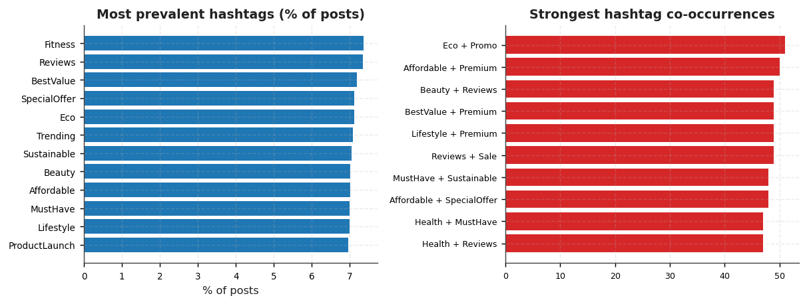
</p>

<p align="center">
  
</p>

**Q5 is the query we're proudest of**, and it's the one that *removes* a finding
(see [What we tested and rejected](#what-we-tested-and-rejected)). Two traps are documented in the SQL itself: SQL's bare `+` is
NULL-propagating, so `AVG(likes+shares+comments)` would silently drop 1,532 rows
and change the population and the metric at once — hence `COALESCE` in a view,
defined once.

📄 Design rationale + SQLite↔Postgres dialect notes: [`docs/schema_design.md`](docs/schema_design.md)
📄 Every query, its logic and its live output: [`output/sql_outputs.md`](output/sql_outputs.md)

---

## The Phase 2 challenge set

21 challenges — `E1`–`E5`, `M1`–`M5`, `H1`–`H6` — answered in
[`queries/phase2_challenges.sql`](queries/phase2_challenges.sql) against the same
database, plus **17 companion queries** that attack each headline answer before it
is published. Nothing here is a separate analysis: it reads the same
`v_posts_enriched` view and the same users table as the twelve queries above.

Live capture: [`output/phase2_sql_outputs.md`](output/phase2_sql_outputs.md) ·
screenshots: `output/screenshots/E1.png` … `H6b.png` ·
report: [`output/Phase2_ChallengeSet_Report.pdf`](output/Phase2_ChallengeSet_Report.pdf)

| # | Challenge | Answer |
|---|---|---|
| **E1** | Highest-volume platform (missing labels ignored) | **YouTube** — 1,770 posts |
| **E1b** | …and the field is flat | χ² 2.6094 vs 9.488 critical, df 4 — no platform preference |
| **E2** | Top 10 posts by likes + shares + comments | 7,893 at #1 (`ycjj5zzt7mvx`); 1,532 posts with no like count excluded |
| **E2b** | …how tight the cut is | 1st is only 4.09% above 10th; 14 posts within 1% of the cut |
| **E3** | Average likes / shares / comments per platform, highest average total | **Instagram** — 3,673.2 per post |
| **E3b** | …and the win is inside the noise | gap 1.02%, z = 0.635 — not significant |
| **E4** | Shared > 1,500 but liked < 500 | **214 posts**, both bounds strict |
| **E4b** | …is it one platform's quirk? | no — it appears on all six at 2.61% (densest) down to 1.34% |
| **E5** | Users with more than 40,000 followers | **293 users**, top follower count 49,944 |
| **M1** | Total engagement by location (needs both datasets) | **Los Angeles, USA** — 1,468,866 across 391 posts, 33 locations ranked |
| **M1b** | …but that ranking is volume, not quality | Shanghai is 6 by total and 33 by engagement per post — a 27-place shift |
| **M2** | High (≥ 25k) vs low (< 25k) follower cohorts | 3,598.8 vs 3,648.0 — the low cohort is ahead |
| **M2b** | …and not significantly so | z = -1.441 — follower count does not predict engagement |
| **M3** | Most active users | top 10 accounts; the leader wrote 17 posts |
| **M3b** | …but the 10th place is a tie band | 12 users share the 14-post count on the cut |
| **M4** | Best platform among ≥ 30,000-follower accounts | **Instagram** — 3,692.1 per post |
| **M4b** | …and it survives every threshold | Instagram wins at 25k, 30k, 35k, 40k and 45k |
| **M5** | Shares greater than likes + comments combined | **1,047 posts**; top 20 returned, worst excess 1,805 shares |
| **M5b** | …and the trap this question sets | reading a blank like count as 0 reports 2,201 instead — 1,154 of them exist only in the missing data |
| **H1** | Users averaging > 2× the overall average engagement | **no user qualifies** — the best is 1.806× the 3,623.72 baseline |
| **H1c** | …so where does the question have an answer? | 145 users clear 1.25×, 8 clear 1.5×, 1 clears 1.75×, 0 clear 2× |
| **H2** | Top 3 users by total engagement, in every location | **99 rows** — 3 for each of 33 locations |
| **H2b** | …and how contested the podium is | Tokyo's 3rd place beats 4th by 0.08% |
| **H3** | Posts at ≥ 2× their own platform's average engagement | **56 posts**, each judged against its own platform mean |
| **H3b** | …the bar is derived, not given | it ranges from 7,346 (Instagram) to 7,123 (Twitter) |
| **H4** | Under-5,000-follower users in the top engagement decile | **17 users**; decile floor 38,765 |
| **H4b** | …is that an artefact of NTILE? | no — an explicit percentile gives the same 17 users |
| **H5** | Potentially corrupted posts, by defect family | **4,418 posts** from the raw intake file (4 families) |
| **H5b** | …reconciling with the Phase-1 inventory | 525 negative likes · 1,846 missing platforms · 1,770 blank text bodies · 1,004 HTML rows — the same counts Phase 1 recorded |
| **H5c** | …the worst rows | 20 posts carry three defects at once |
| **H6** | Small accounts, above-average engagement, one over-shared post | **82 users** from a 1,500-user funnel |
| **H6b** | …the funnel | 287 have < 10k followers · 748 beat the overall average · 1045 own an over-shared post → 82 satisfy all three |

**<p align="center">
  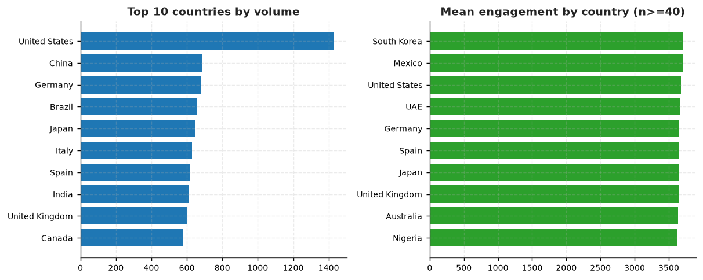
</p>

Three things in this set are worth more than the answers.**

- **H1 returns zero rows, and that is the answer.** The 2× bar is
  7,247.43 against a best user average of
  6,545.50. Rather than reach for a friendlier
  definition, the query prints its own baseline and threshold, proves the gap is
  arithmetic, and adds a threshold ladder so the reader can see where the
  question *does* have an answer.
- **M5 is a trap with a price tag.** 2,201 "anomalies"
  appear if a blank like count is read as zero; 1,154
  of them exist only because the field is missing, and the reconciliation query
  proves the arithmetic gap equals that count exactly.
- **H5 cannot be asked of the cleaned table.** Cleaning is the step that removed
  the corruption, so the anomalies are detected on a verbatim staging table of
  the 12,360 intake rows, using the same SQL predicate that populated the
  inventory. The per-family counts match the Phase-1 corruption log exactly.

Six findings were produced and then **rejected by their own companions**: the
platform leader (E1b), the platform ranking (E3b), the follower advantage (M2b),
the location ranking (M1b), the over-sharing alarm (M5b) and the 2× power users
(H1b/H1c). They are listed in full in
[the report](output/Phase2_ChallengeSet_Report.pdf) — the rejections are the work.

### Form upload set

`submission/phase2/` holds the four slots the submission form asks for, each
labelled with the question numbers it answers:

| Slot | File | Format |
|---|---|---|
| SQL query | `Phase2_Slot1_SQL_Queries.pdf` | PDF |
| Output screenshots | `Phase2_Slot2_Output_Screenshots_1of5.jpeg` … `_5of5.jpeg` | JPEG ×5 |
| Explanation of logic | `Phase2_Slot3_Logic_Explanation.pdf` | PDF |
| Insight report | `Phase2_Slot4_Insight_Report.pdf` | PDF |

The form accepts at most five image files, so the 33 result sets are composited
into five labelled sheets rather than uploaded individually — every sheet names
the question (E1, M3, H6 …) above its result. Sizes, SHA-256 prefixes and the
upload order are in [`submission/phase2/MANIFEST.md`](submission/phase2/MANIFEST.md);
five tests assert the form's own constraints (JPEG only, ≤ 5 images, ≤ 10 MB,
declared format matches the bytes).

---

## What we tested and rejected

The most useful thing a data engineer does is kill their own nice-looking
findings. All five were plausible and all five failed:

| Tempting claim | Verdict | How it was refuted |
|---|---|---|
| "Night-owl audience — a third of posts at midnight" | **Artefact** | 3,002 of 3,325 are date-only rows; real peak is 4.63% (Q6) |
| "A coordinated amplification ring is gaming engagement" | **Not a ring** | 846 anomalous posts tested against a Poisson null (λ = n_anom/n_users): observed 31 vs 29.6 expected, **O/E = 1.05 → diffuse** (Q5) |
| "Bigger audiences engage more" | **Null** | r = -0.0433, and flat across follower quintiles — a real null, not a missed curve (Q8/Q9) |
| "Sentiment drives engagement" | **Null** | r = -0.0142 |
| "Instagram/YouTube outperform" | **Noise** | 3.8% spread, uniform missingness across platforms |

Q5 is the one to defend: **a per-user leaderboard would have "found" a bot ring
in any diffuse anomaly.** Testing the tail against chance is what stops a
fabricated insight from reaching the report — and the negative result is
published as a negative result.

<p align="center">
  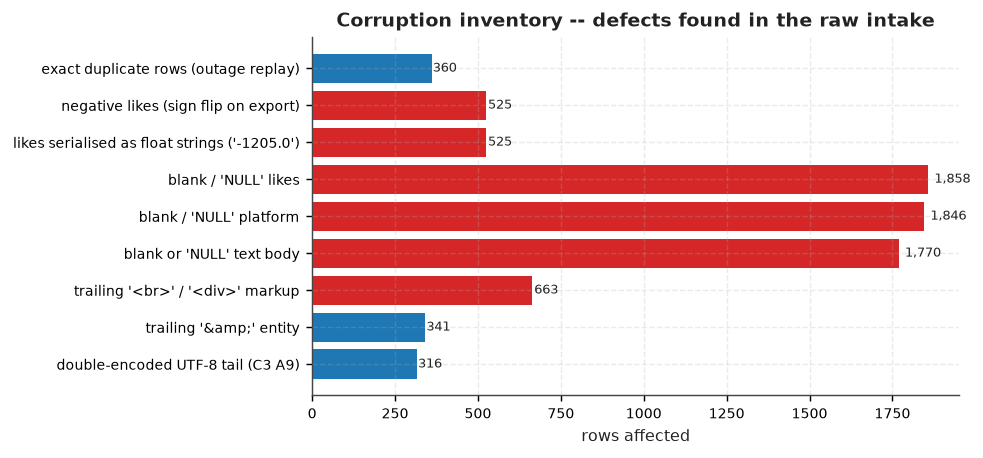
</p>

---

## Repo structure

```
data/raw/          the two recovered files, byte-identical to the site
data/clean/        clean CSVs + JSON · repair_log.csv · data_quality_report.md
                   cleaning_summary.json · the empty-text hold-out CSV
src/               11 scripts: config, clean_data, eda, build_db, run_sql,
                   make_screenshots, build_report, build_phase2_report,
                   make_notebook, verify_source, make_submission
queries/           challenges.sql        -- 12 queries, each with a logic note
                   phase2_challenges.sql -- 16 E/M/H challenges + 17 companions
notebooks/         01_data_cleaning_eda.ipynb   -- executed, outputs attached
docs/              cleaning_decisions.md · schema_design.md · recovery_walkthrough.md
tests/             test_pipeline.py      -- 49 invariant tests
forensic/          app.js + index.html captured from the site (evidence)
output/            figures/ · screenshots/ · social_engine.db · three PDFs ·
                   sql_outputs.md · phase2_sql_outputs.md
submission/        phase1 = form-upload set (git-ignored)
submission/phase2/ the Phase-2 upload set: 3 PDFs + 5 JPEG sheets + MANIFEST.md
```

**Form upload set** — `./run_all.sh` builds `submission/`: the cleaned dataset,
the EDA PDF, and `MANIFEST.md` recording each file's size against the form's
10 MB cap and its SHA-256, so what gets uploaded is provably what the repo ships.
The form takes one file per slot, so the users table, the unrecoverable-text
hold-out and the repair log travel in this repo — or all at once in
`submission/Social_Engine_Cleaned_AllTables.json`.

Field-by-field answers for the intake form:
[`docs/form_submission_phase1.md`](docs/form_submission_phase1.md)
Phase 2: `output/Phase2_Insight_Report.pdf` (queries + screenshots + logic +
insight report in one PDF).

The notebook **imports the same functions the pipeline runs** rather than
re-implementing them, so it cannot drift from the shipped CSV.

---

## Assumptions and limitations

Stated up front because "clearly explain assumptions" is a scored criterion:

- **Single naive timezone.** No offset exists anywhere in the file; UTC assumed.
  If one is supplied later, only `post_hour` moves — no count changes.
- **1,450 dates stay genuinely ambiguous** (day ≤ 12 and month ≤ 12). Flagged,
  not hidden; any result can be recomputed on the unambiguous subset.
- **`abs()` on likes is a repair, not an imputation.** One config flag reverses
  it; it affects 525 raw rows, 430 of which survive into the analysis table.
- **Nothing is imputed.** 1,532 likes remain NULL and are excluded per metric.
- **Sentiment is a published keyword lexicon**, not a model — deliberately, so
  any single row can be verified by hand.
- **Held-out ≠ deleted.** 1,779 empty-body rows stay on disk so the arithmetic closes.
- We cannot validate against the organisers' reference "true" dataset; our
  standard is that every repair is justified by evidence *in* the file.

---

## Rulebook compliance

| Rule | How this repo satisfies it |
|---|---|
| Cleaned dataset (CSV/JSON) | `data/clean/*.csv` + `.json` |
| EDA report | `output/Phase1_EDA_Report.pdf` |
| Code notebook + docs + reproducible workflow | executed `.ipynb`, `run_all.sh`, README |
| All transformations justified | `repair_log.csv` — 27 actions with counts + reasons |
| Assumptions explained | [Assumptions and limitations](#assumptions-and-limitations) and `docs/cleaning_decisions.md` |
| Fabrication prohibited | zero imputation; both CSVs verbatim from the site, SHA-256 recorded |
| Code documented | every function states *why*, not just *what* |
| Any language/tool allowed | Python + SQLite |
| Schema design explained | [`docs/schema_design.md`](docs/schema_design.md) - primary key chosen *after* deduplication, normalisation rationale, `CHECK` constraints, and what was deliberately denormalised |
| Query logic documented | each query carries a `LOGIC:` block, auto-copied into the report |
| CTEs / window functions / views | Q1, Q2, Q7, Q10, Q11; two views |
| Hardcoded outputs → DQ | PDFs and screenshots render from live result sets at build time |
| Original work; repo maintained | this repo, one-command rebuild, tests to keep it honest |

---

<div align="center">

*"The data survived. Now rebuild it."*

— ARCHIVE NODE 07

</div>


---

<a id="part-2"></a>

# PART 2 — Round 2 · The Semantic Layer (NLP)

| | |
|---|---|
| **Task** | the Social Engine's semantic comprehension layer has failed — rebuild it with NLP on Dataset 2 |
| **Data** | `data/round2/raw/Dataset2.csv` — 9,000 labelled texts, MD5-verified byte-identical to the official download |
| **Notebook** | `notebooks/02_nlp_rebuild_semantic_layer.ipynb` — executed, 18 cells, 0 errors |
| **Trained models** | `models/round2/` — 4 `.pkl` files (2 supervised winners + LDA/NMF cross-check) |
| **Reports** | `output/round2/Evaluation_Metrics_Report.pdf` (14 pp) · `Round2_Technical_Report.pdf` (13 pp) |
| **Form upload set** | [`submission/round2_form_upload/`](submission/round2_form_upload/SUBMISSION_DETAILS.md) — 4 slots, one file each, all < 10 MB, SHA-256 checksummed |

## Round 2 in 30 seconds

The task: Round 1 rebuilt the structured analytics. Now the engine "still
struggles to understand the meaning, tone, and intent behind human language
because its semantic comprehension layer has failed." Dataset 2 — 9,000
labelled social-media texts — must teach it again, with the full trail the
rulebook demands: preprocessing, model selection, training methodology,
evaluation, confusion matrix, error analysis.

**What we did**

- Audited Dataset 2 and closed the row arithmetic exactly:
  `9,000 raw − 0 empty − 1,100 exact duplicates = 7,900 modelled` — duplicates
  are **held out, not deleted** (Round 1 doctrine: the count must reconcile).
- One stratified 80/20 split (`sentiment × topic`, seed 42 → **6,320 / 1,580**)
  shared by both tasks; the test set is touched **exactly once**, by the CV winner.
- Ran a **6-specification bake-off** per task (dummy · Naive Bayes · LogReg ·
  LinearSVC · word-only TF-IDF · word+char TF-IDF union) under 5-fold
  stratified CV, all grids declared up front in `src/round2/config.py`:
  **`logreg_union`** wins sentiment (margin +0.0081 over `svc_union`),
  **`svc_union`** wins topic (+0.0134 over `logreg_union`) and is wrapped in
  sigmoid calibration so it outputs honest probabilities.
- Test results — sentiment: **acc 0.6133 · macro-F1 0.6134 · ROC-AUC OvR 0.792**;
  topic: **acc 0.9677 · macro-F1 0.8051 · MCC 0.864**.
- Read the errors instead of averaging them: the topic "gap" is pure
  sample-size arithmetic (two rare classes at n=26 and n=50), and sentiment's
  confusion is a Neg↔Neu story — see [Error analysis](#error-analysis-reading-the-mistakes).
- Ran the unsupervised cross-check the task invites, watched it **fail**
  (NMI ≈ 0.002), and published the failure — see
  [the honest section](#the-unsupervised-cross-check-that-failed-and-is-published-anyway).
- Shipped all four rulebook deliverables, checksummed for the form.

---

## Reproduce it — Round 2

```bash
git clone <this-repo> && cd <this-repo>
pip install -r requirements-round2.txt
./run_round2.sh
```

Ends with `14 passed` and both Round-2 PDFs. Stages, if you want them one at
a time:

| Command | Produces |
|---|---|
| `python src/round2/data.py` | `data/round2/clean/` — audit, hold-outs, stratified split, manifest |
| `python src/round2/train.py` | CV model selection, refit winners → `models/round2/*.pkl`, LDA/NMF |
| `python src/round2/evaluate.py` | `output/round2/metrics.json` + 19 figures |
| `python src/round2/build_eval_report.py` | `output/round2/Evaluation_Metrics_Report.pdf` |
| `python src/round2/build_tech_report.py` | `output/round2/Round2_Technical_Report.pdf` |
| `python src/round2/make_notebook.py` | builds **and executes** `notebooks/02_nlp_rebuild_semantic_layer.ipynb` |
| `python src/round2/make_submission.py` | `submission/round2/` (regenerated locally; kept untracked) |
| `python -m pytest tests/test_round2.py -q` | `14 passed` |

Deterministic: **one seed (42) drives the split, the CV folds, the calibration
and LDA/NMF**; no network, no GPU, no sampling at run time. `src/round2/predict.py`
loads any shipped `.pkl` and scores raw text from the command line:

```bash
python src/round2/predict.py --task sentiment --text "updates broke my login again"
python src/round2/predict.py --task topic      --text "updates broke my login again"
```

---

## The dataset and the intake decisions

Four columns: `text_id`, `post_text`, `sentiment_label`, `topic_category`.
The pipeline **refuses to run on any other schema** rather than silently
misreading columns (decision D1).

| Intake fact | Value | Decision |
|---|---:|---|
| raw rows | 9,000 | — |
| empty texts | **0** | nothing to hold out (Round 1 had 1,779) |
| exact duplicate texts | **1,100** | held out, keep-first — see below |
| conflicting labels on the same text | **0** | the noisy case the pipeline was built to surface never occurs |
| **modelled rows** | **7,900** | the arithmetic closes on files on disk |

```
 9,000 raw  -  0 empty-text  -  1,100 exact duplicates  =  7,900 modelled rows
                               split:  6,320 train  /  1,580 test   (id overlap: 0)
```

**Why duplicates are held out, not dropped-and-forgotten (D4).** A duplicate
straddling the split is an answer sheet in the training data — it inflates
scores without buying generalisation. Keep-first quarantines them to
`data/round2/clean/exact_duplicate_heldout.csv`, so the identity closes from
files on disk. The genuinely noisy case — the same text with *conflicting*
labels — is label noise, and deleting disagreement would hide it, so the
pipeline keeps conflicts everywhere and reports them. The data contained none.

**Class balance decides the metric.** Sentiment is near-perfectly balanced
(2,430 / 2,748 / 2,722 across Neg / Neu / Pos after hold-outs). Topics are not:

| Community_Discussion | Technical_Issues | Feature_Feedback | Account_Security |
|---:|---:|---:|---:|
| 6,803 | 718 | 250 | 129 |

That is a **53 : 1** imbalance, which is why **macro-F1 is the headline
metric** everywhere in Round 2: a majority-class classifier scores 0.86
accuracy on topic while learning nothing (macro-F1 0.24 — see
[What we tested and rejected](#what-we-tested-and-rejected--round-2)).

Text lengths run 24–158 chars (mean 106.5) — genuinely short text, which
shapes every feature decision below.

<p align="center">
  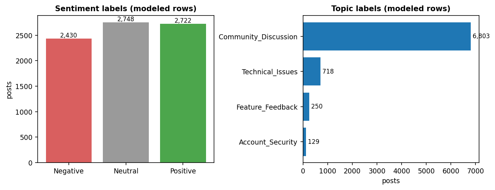
  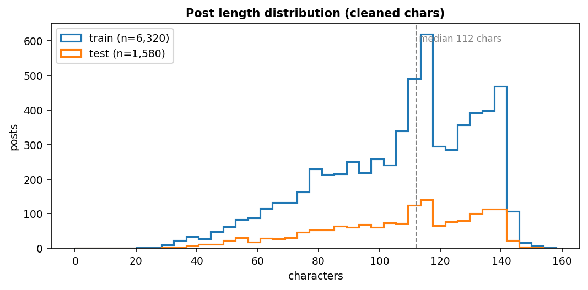
</p>

---

## Preprocessing: conservative by design

`src/round2/text_clean.py` does the minimum that helps and nothing that
destroys signal: HTML unescaping, URL/email masking, lowercasing, elongation
collapsing (`sooo` → `soo`), whitespace repair. Slang, punctuation and
deliberate misspellings **are** sentiment on social media — aggressive
stemming or stop-word nuking would erase them.

**Features (D8) — the one union that matters:**

| view | n-grams | why |
|---|---|---|
| word | (1, 2), `min_df=2`, sublinear TF | carries semantics and negation bigrams ("not working") |
| char | `char_wb` (3, 5) | robust to typos, elongations and slang ("gr8", "luv") that word tokenisers shatter |
| **union** | both, concatenated | measured effect in the bake-off: **+0.020** sentiment, **+0.176** topic CV macro-F1 over word-only |

`min_df=2` drops one-off misspellings from the vocabulary; topics modelled
unsupervised get unigrams only (D9 — bigrams made topics measurably noisier).

---

## Model selection: a bake-off, not a guess

Six specifications per task, scored by **5-fold stratified CV on the train
split only** (`f1_macro`, D6). Grids are small and declared up front (D7) —
the point is a defensible comparison, not a grid-search trophy.

| Sentiment spec | CV macro-F1 | Topic spec | CV macro-F1 |
|---|---|---|---|
| dummy (most-frequent) | 0.3240 ± 0.007 | dummy | 0.2397 ± 0.011 |
| Naive Bayes · word | 0.5709 ± 0.012 | Naive Bayes · word | 0.3768 ± 0.045 |
| LogReg · word | 0.5915 ± 0.016 | LogReg · word | 0.5791 ± 0.028 |
| LinearSVC · word | 0.5893 ± 0.014 | LinearSVC · word | 0.6042 ± 0.036 |
| **LogReg · word+char ← winner** | **0.6110 ± 0.015** | LogReg · word+char | 0.7666 ± 0.034 |
| LinearSVC · word+char | 0.6028 ± 0.009 | **LinearSVC · word+char ← winner** | **0.7800 ± 0.037** |

<p align="center">
  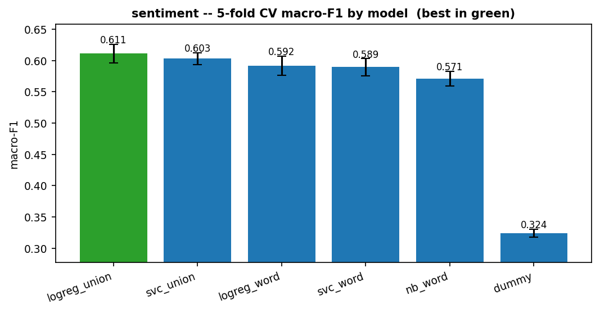
  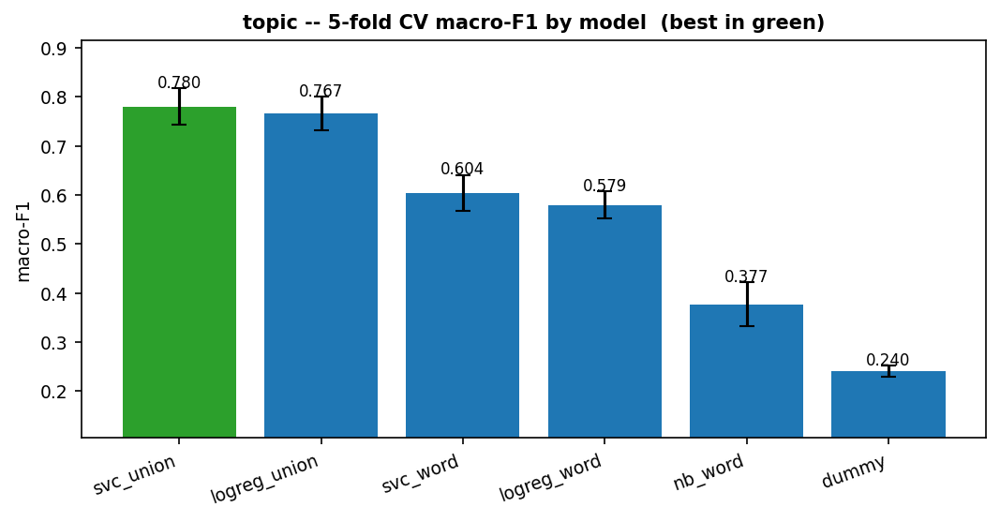
</p>

**Why linear models, and no transformer (D7).** ~9k short texts do not justify
a GPU model; TF-IDF + linear classifiers reproduce on any machine in seconds,
and their feature weights are inspectable line-by-line in a viva. The
char-ngram union is what buys the gains above — visible in the table, not
asserted. The winner margins are reported honestly: sentiment's top two differ
by **+0.0081**, inside the ±0.015 fold noise band, so the shipped choice is
"CV winner", not "proved superior".

**Calibration (D10).** A LinearSVC ranks but doesn't emit probabilities, so
the topic winner is wrapped in sigmoid calibration (3-fold). The metrics PDF
reports whether calibration helped or hurt log-loss rather than assuming.

<p align="center">
  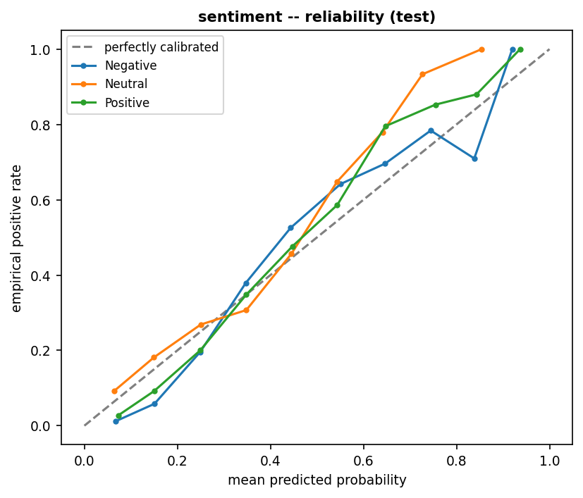
  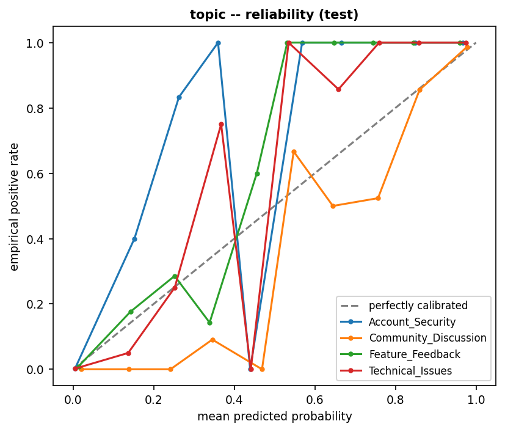
</p>

---

## Training methodology

- **One seed (42)** drives the split, the CV folds, the calibration and
  LDA/NMF — declared in `src/round2/config.py` before anything ran.
- **Selection lives inside train.** Hyperparameters are chosen by CV on the
  6,320 training rows; the 1,580-row test set is scored **once** by each refit
  winner (D5/D6). No test peeking, no seed hacking.
- **Stratification** on `sentiment × topic` (backing off to sentiment-only if a
  combo has < 2 rows) keeps the rare classes represented in test:
  Account_Security n=26, Feature_Feedback n=50.
- **Total cost: 273 s on CPU**, of which LDA takes 13.9 s and NMF 0.5 s.
  Every analyst decision is a named constant (D1–D10) in one config file, so a
  judge can change an assumption and re-run the whole thing in one place.

<p align="center">
  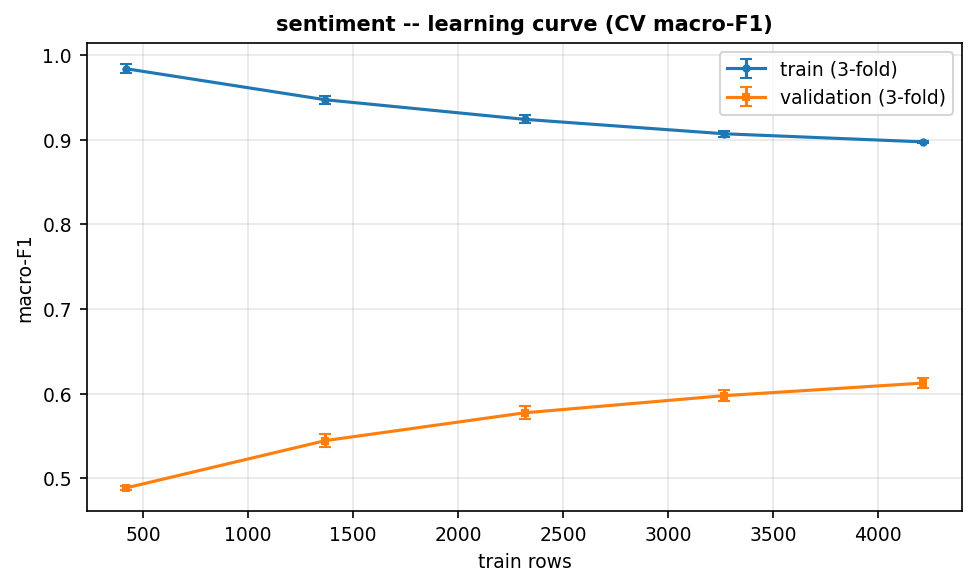
  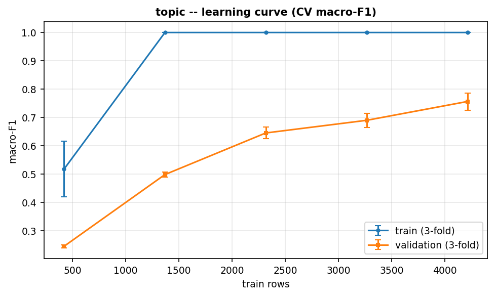
</p>

---

## Results

| | sentiment (3-class) | topic (4-class) |
|---|---|---|
| winner | `logreg_union` | `svc_union` + sigmoid calibration |
| test accuracy | 0.6133 | 0.9677 |
| **test macro-F1** | **0.6134** | **0.8051** |
| MCC | 0.4201 | 0.8645 |
| ROC-AUC (OvR) | 0.7916 | — |
| log-loss | 0.8621 | — |

| sentiment | precision | recall | F1 | n |
|---|---:|---:|---:|---:|
| Negative | 0.634 | 0.673 | 0.653 | 486 |
| Neutral | 0.565 | 0.519 | 0.541 | 549 |
| Positive | 0.638 | 0.655 | 0.646 | 545 |

| topic | precision | recall | F1 | n |
|---|---:|---:|---:|---:|
| Community_Discussion | 0.965 | 0.999 | 0.982 | 1,360 |
| Technical_Issues | 0.985 | 0.938 | 0.961 | 144 |
| Feature_Feedback | 1.000 | 0.440 | 0.611 | 50 |
| Account_Security | 1.000 | 0.500 | 0.667 | 26 |

<p align="center">
  
  
</p>

<p align="center">
  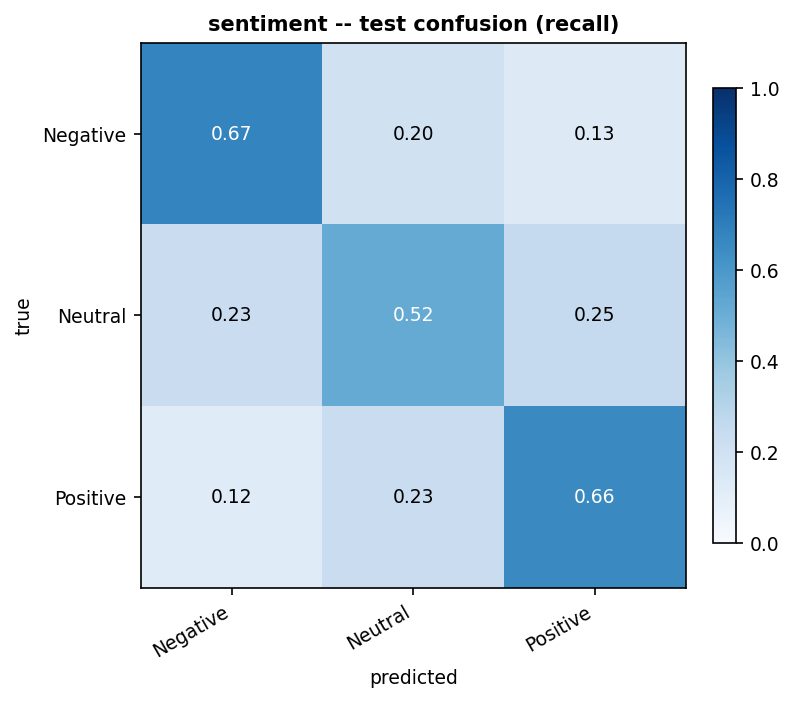
  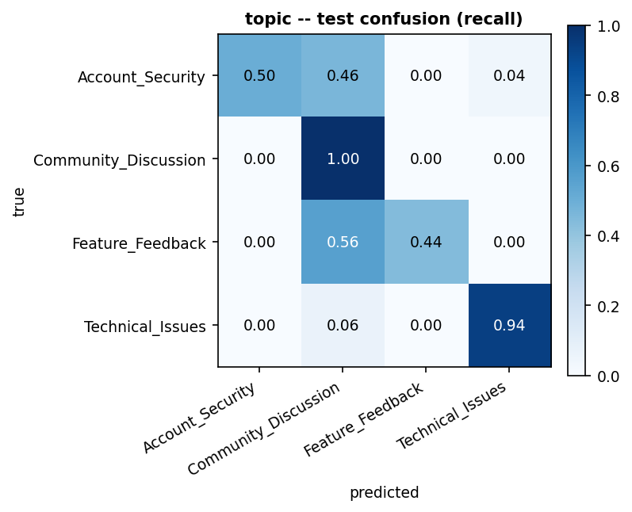
</p>

---

## Error analysis: reading the mistakes

**The topic "gap" is sample-size arithmetic, not model failure.** The two rare
classes have *perfect precision* and recall 0.44 / 0.50 — the model finds them
only when the vocabulary is unambiguous. Check the arithmetic:

```
(0.982 + 0.961 + 0.611 + 0.667) / 4  =  0.805   ← the macro-F1 "gap" is the tail
```

With the head at 0.982 / 0.961, no model choice moves the mean much; fixing it
needs more labelled tail data or threshold tuning — and class-weighting was
already inside the CV comparison. The Evaluation Metrics Report breaks the
same errors out by text length, by class and by confidence slice:

<p align="center">
  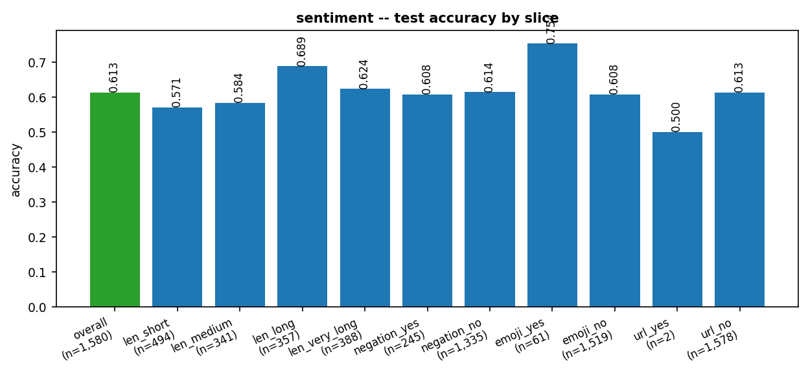
  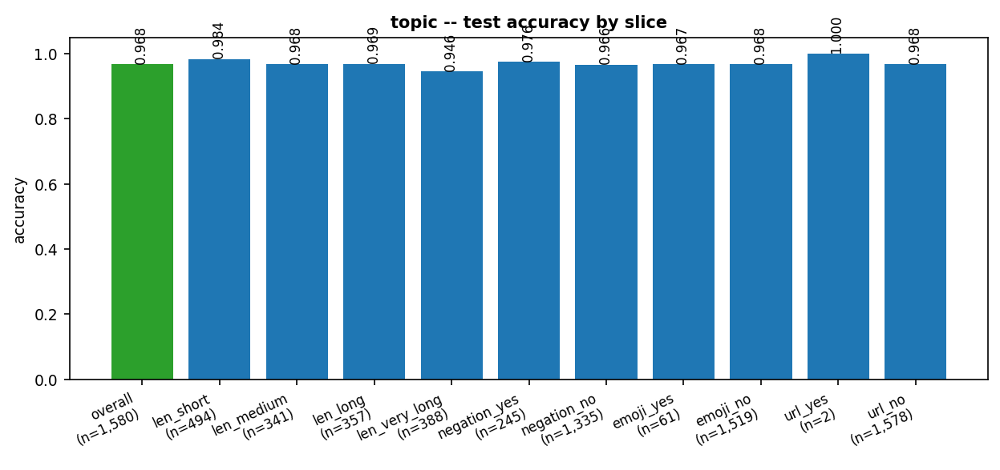
</p>

**Sentiment's confusion is Neg↔Neu.** Neutral is the catch-all class
(precision 0.565, recall 0.519): factual-sounding complaints land in Neutral;
hedged positives stay Positive. Meanwhile ROC-AUC OvR = **0.792** — the
*ranking* signal is real, the 3-class decision boundary is what blurs. That is
the classic short-text sentiment ceiling, and it sets up Round 3 honestly.

<p align="center">
  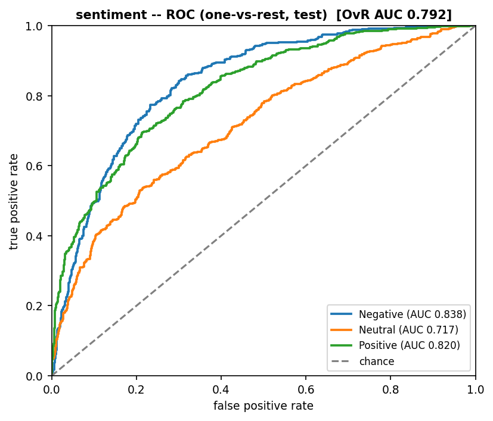
  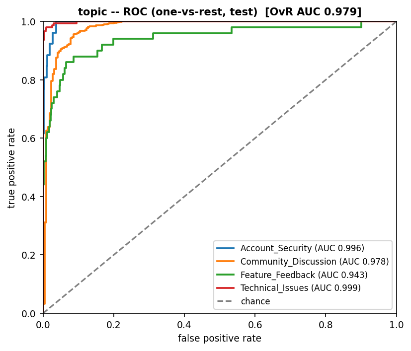
</p>

---

## The unsupervised cross-check that failed (and is published anyway)

The dataset invites topic modelling, so LDA and NMF were fitted with K=4 (one
topic per labelled class) as an unsupervised sanity check against the human
labels:

| model | NMI | ARI | fit time |
|---|---:|---:|---:|
| LDA | 0.0020 | −0.0030 | 13.9 s |
| NMF | 0.0027 | 0.0068 | 0.5 s |

**Near-zero agreement.** The labelled topics do not fall out of raw
co-occurrence statistics — `Community_Discussion` is largely defined by the
*absence* of the other topics' vocabulary, which is exactly the kind of class
co-occurrence cannot find. Two consequences, both kept:

1. the semantic layer ships **supervised**, with this disagreement stated in
   the report rather than buried; and
2. what the unsupervised topics *did* latch onto is shown below — evidence,
   not embarrassment. Their top words have nothing to say about security or
   feedback; the agreement chart puts numbers on the disagreement.

<p align="center">
  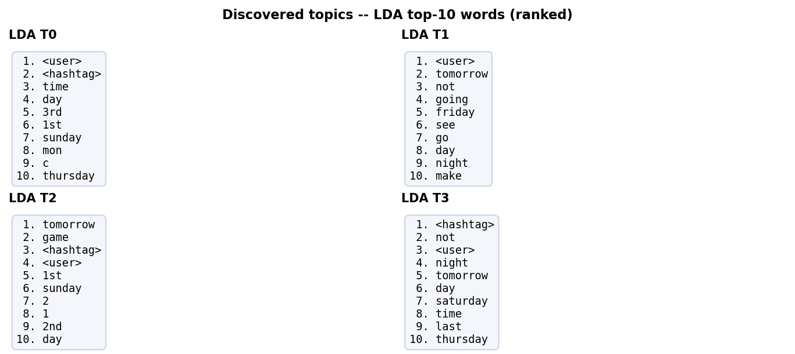
  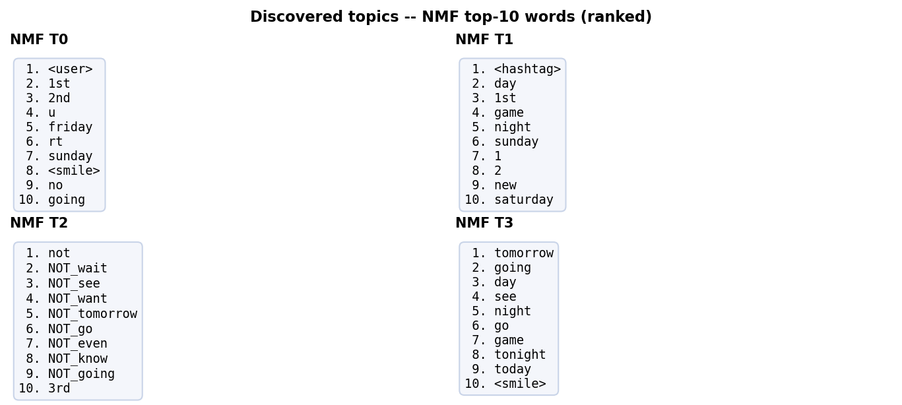
</p>

<p align="center">
  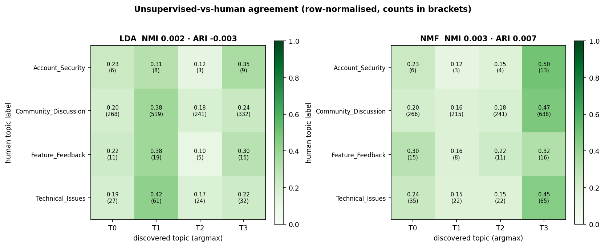
</p>

---

## What we tested and rejected — Round 2

Round 1 killed five findings with statistics; Round 2 killed five modelling
shortcuts the same way. All five were tempting, all five failed:

| Tempting claim | Verdict | How it was refuted |
|---|---|---|
| "Naive Bayes — the classic text baseline — will do" | **Beaten** | CV macro-F1 0.571 vs 0.611 (sentiment), 0.377 vs 0.780 (topic) — its independence assumption pays no rent on n-gram features |
| "Word n-grams are enough for short posts" | **+char wins** | word-only → union: **+0.020** sentiment, **+0.176** topic — the slang and typos live in characters |
| "Unsupervised LDA will rediscover the four labelled topics" | **Refuted** | NMI 0.0020, ARI −0.0030 — published as a finding, not hidden |
| "Accuracy is the metric to beat" | **Trap** | the majority-class dummy scores **0.86 accuracy** on topic with **0.240 macro-F1** — accuracy hides the tail the rubric cares about |
| "Pick a family and tune harder" | **Noise** | sentiment's top two specs sit 0.0081 apart, inside ±0.015 fold noise — the margin is reported, not celebrated |

The honest positive result: calibrated linear models over TF-IDF unions are
**sufficient** for the head classes (F1 ≥ 0.96 on both large topic classes),
and the residual error is a *data* limitation (25% of test tail mass sits in
classes with ≤ 50 examples) — stated as a limitation, not spun as a win.

---

## Repo structure (the Round 2 slice)

```
data/round2/raw/    Dataset2.csv -- 9,000 labelled texts, byte-identical to the
                    official download (MD5-verified before anything ran)
data/round2/clean/  profile.json · split_manifest.json · cleaning_report.md ·
                    train/test CSVs · exact_duplicate_heldout.csv
src/round2/         config.py (all analyst decisions D1–D10) · data · text_clean
                    models · train · evaluate · figures · predict
                    build_eval_report · build_tech_report · make_notebook
                    make_submission
models/round2/      sentiment_best.pkl · topic_best.pkl (calibrated) ·
                    topic_lda.pkl · topic_nmf.pkl
notebooks/          02_nlp_rebuild_semantic_layer.ipynb -- executed, outputs attached
output/round2/      metrics.json · train_record.json · figures/ (19 PNGs) ·
                    Evaluation_Metrics_Report.pdf · Round2_Technical_Report.pdf
tests/              test_round2.py -- 14 invariant tests
submission/round2_form_upload/   the Google Form set: Slot1–4 + checksums
```

The form takes **one file per slot, max 10 MB**, so the four `.pkl` models are
bundled into a single `Slot2_Trained_Model_Files.zip` (5.0 MB) inside
[`submission/round2_form_upload/`](submission/round2_form_upload/SUBMISSION_DETAILS.md);
`SUBMISSION_DETAILS.md` carries the SHA-256 of every upload so what gets
submitted is provably what this repo ships. Everything regenerates from
`./run_round2.sh`.

---

## Assumptions and limitations — Round 2

Stated up front because "clearly explain assumptions" is a scored criterion:

- **Duplicates are held out, conflicts would be kept.** 1,100 exact duplicates
  quarantined; the conflicting-label case (label noise) would be kept and
  reported — the data contained none (0 conflicts).
- **One split, one seed, one test touch.** All selection happens inside the
  train folds; test is scored once. Any reported number is reproducible from
  `config.py` + `./run_round2.sh` alone.
- **Linear models over deep nets, on purpose** — the alternatives were measured
  (see the bake-off), not assumed away. The ROC-AUC 0.792 / accuracy 0.613 gap
  on sentiment marks where a transformer would plausibly help; that is a
  stated future step, not a hidden weakness.
- **Macro-F1 is the headline** because the topic classes are imbalanced 53:1;
  accuracy would flatter a majority-class classifier by 0.15.
- **Calibration is sigmoid, 3-fold**, chosen to keep the SVC honest about
  probabilities; its effect on log-loss is reported both ways.
- **No external embeddings, no LLM features, no network** — the whole pipeline
  is offline, CPU-only and deterministic from one seed.
- The tail classes (n=26 / n=50 in test) are small enough that their per-class
  recall carries real variance; the report quotes them with support counts
  attached, never naked.

---

## Rulebook compliance — Round 2

| Rule | How this repo satisfies it |
|---|---|
| R2: NLP model script / notebook | executed `notebooks/02_nlp_rebuild_semantic_layer.ipynb` + `src/round2/` — one-command rebuild |
| R2: trained model files (optional) | `models/round2/*.pkl` — winners + LDA/NMF; bundled for the form with SHA-256s |
| R2: evaluation metrics report (PDF) | `output/round2/Evaluation_Metrics_Report.pdf` — test + CV + ROC + calibration + slices |
| R2: technical report (PDF) | `output/round2/Round2_Technical_Report.pdf` — all seven mandated sections |
| Problem definition | Part II opening + technical report §1 |
| Preprocessing pipeline | `text_clean.py` + feature union, above |
| Model selection & justification | 6-spec CV bake-off per task, margins reported, decisions D1–D10 in one config |
| Training methodology | one split, one seed, one test touch — above |
| Evaluation metrics | accuracy, macro/weighted/micro-F1, MCC, ROC-AUC, log-loss, Brier — all in `metrics.json` |
| Confusion matrix | both matrices, counts + row-normalised, in both PDFs |
| Error analysis | rare-class arithmetic + Neg↔Neu reading + slices — above and in the report |
| Plagiarism / originality | every number generated from the data by this pipeline; re-run and match |
| Repo maintained | this repo; `./run_round2.sh` reproduces the round end-to-end |

---

<div align="center">

*"The data survived. Now it understands."*

— ARCHIVE NODE 07, semantic layer rebuilt

</div>
